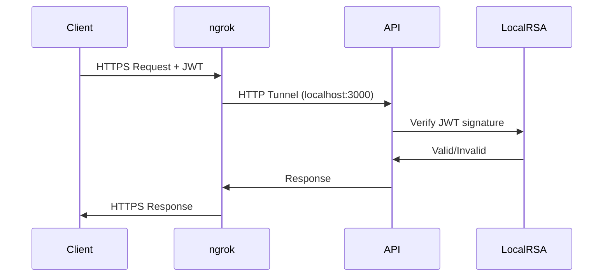

# ADR-010: ngrok Setup for Local Testing Infrastructure

* **Status**: Proposed  
* **Date**: 2025-05-30  
* **Authors**: @shokhzodjon-tuyokov, @bookmarkai-core  
* **Supersedes**: —  
* **Superseded by**: —  
* **Related**: ADR-002 (JWT Auth), ADR-004 (Shares Endpoint), ADR-006 (React Native), ADR-007 (iOS Extension), ADR-009 (WebExtension)

---

## 1 — Context  

Task 1.10 bridges local development with mobile/extension testing by exposing the BookmarkAI API (`localhost:3000`) to external devices. Current pain points:

* **iOS Share Extension** (Task 1.7) requires HTTPS API access from physical devices
* **Android Intent Filter** (Task 1.8) needs device-accessible endpoints for testing  
* **Browser WebExtension** (Task 1.9) must reach local API from different browser contexts
* **React Native mobile app** (Task 1.6) testing across iOS Simulator, Android Emulator, and physical devices

All clients depend on JWT authentication (ADR-002) and the `/v1/shares` endpoint (ADR-004). Local testing currently requires complex network configuration or deployment to staging environments.

## 2 — Decision  

We will implement **ngrok-based local tunneling** with the following architecture:

| Component | Implementation |
|-----------|----------------|
| **Tunnel Provider** | ngrok with **reserved domain** `bookmarkai-dev.ngrok.app` and team authtoken |
| **Authentication** | **Local RSA key pair** for JWT signing; KMS service stubbed in development |
| **Environment Automation** | Dynamic URL injection via build-time scripts and runtime environment detection |
| **CORS Configuration** | Regex pattern `^https://[\w-]+\.ngrok\.app$` covering all team subdomains |
| **Media Strategy** | Large uploads (>10MB) bypass tunnel via **direct S3 presigned URLs** |
| **Resilience** | Client retry logic with exponential back-off for ngrok-specific error codes |
| **Fallback Plan** | Cloudflare Tunnel evaluation if bandwidth limits become restrictive |

### 2.1 Core Architecture

```typescript
// Environment configuration
interface NgrokConfig {
  NGROK_ENABLED: boolean;
  NGROK_DOMAIN: 'bookmarkai-dev.ngrok.app';
  NGROK_AUTH_TOKEN: string; // Team token
  NGROK_REGION: 'us';
  API_BASE_URL: string; // Auto-injected at build/runtime
  JWT_SIGNING_MODE: 'local' | 'kms';
}
```

### 2.2 Client Integration Strategy

| Client Type | URL Injection Method | Build Integration |
|-------------|---------------------|-------------------|
| **React Native** | Metro resolver + environment detection | `API_BASE_URL` from build script |
| **iOS Extension** | Info.plist configuration + Swift constants | Xcode build phase script |
| **WebExtension** | Vite environment variables | Build-time manifest injection |

### 2.3 Authentication Flow



## 3 — Options Considered  

| Option | Pros | Cons | Decision |
|--------|------|------|----------|
| **A. ngrok reserved domain (chosen)** | Stable URL, HTTPS, team sharing, well-documented | Bandwidth limits, subscription cost | ✅ Chosen |
| **B. LocalTunnel** | Free, simple setup | Unreliable connections, no HTTPS guarantee | ❌ Rejected |
| **C. Cloudflare Tunnel** | Better performance, zero bandwidth limits | Complex setup, overkill for dev | 🔄 Future fallback |
| **D. SSH tunneling** | No third-party dependency | Manual setup, no HTTPS, hard to share | ❌ Rejected |
| **E. Local network exposure** | Direct connection | Security risks, network complexity | ❌ Rejected |

## 4 — Technical Specifications

### 4.1 Environment Automation

**Build Script (`scripts/setup-ngrok.js`)**:
```javascript
const ngrok = require('ngrok');
const fs = require('fs');

async function setupNgrokEnvironment() {
  const url = await ngrok.connect({
    proto: 'http',
    addr: 3000,
    subdomain: 'bookmarkai-dev',
    authtoken: process.env.NGROK_AUTH_TOKEN,
    region: 'us'
  });
  
  // Inject URL into all client environments
  updateReactNativeConfig(url);
  updateiOSConfiguration(url);
  updateWebExtensionManifest(url);
  
  console.log(`🚀 API accessible at: ${url}`);
}
```

### 4.2 CORS Configuration

**API Gateway (`packages/api-gateway/src/config/cors.ts`)**:
```typescript
export const corsConfig = {
  origin: [
    /^https:\/\/[\w-]+\.ngrok\.app$/, // All ngrok subdomains
    'http://localhost:3000',          // Local web development
    'http://localhost:3001',          // Local frontend dev server
  ],
  credentials: true,
  optionsSuccessStatus: 200
};
```

### 4.3 Media Upload Strategy

**Direct S3 Upload for Large Files**:
```typescript
// Skip tunnel for files >10MB
if (file.size > 10 * 1024 * 1024) {
  const presignedUrl = await s3Service.getPresignedUploadUrl();
  return uploadDirectToS3(file, presignedUrl);
}
// Use tunnel for metadata and small files
return uploadViaTunnel(file);
```

### 4.4 Retry Logic

**Client-side Error Handling**:
```typescript
const NGROK_ERROR_CODES = {
  TUNNEL_OFFLINE: 502,
  BANDWIDTH_EXCEEDED: 402,
  CONNECTION_TIMEOUT: 504
};

async function apiCallWithNgrokRetry(request: ApiRequest) {
  return retry(request, {
    retries: 3,
    retryCondition: (error) => 
      Object.values(NGROK_ERROR_CODES).includes(error.status),
    retryDelay: exponentialDelay(1000) // 1s, 2s, 4s
  });
}
```

## 5 — Implementation Plan

### Phase 1: Core Setup (Day 1, Hours 1-4)
1. **ngrok Configuration**
   - Reserve team subdomain `bookmarkai-dev.ngrok.app`
   - Configure team authtoken in shared environment
   - Test basic tunnel connectivity

2. **JWT Local Signing**
   - Generate RSA key pair in `dev/keys/`
   - Update JWT service to use local keys when `NODE_ENV=development`
   - Verify token generation and validation

### Phase 2: Environment Automation (Day 1, Hours 5-6)
3. **Build Integration**
   - Create `scripts/setup-ngrok.js` for URL injection
   - Update `package.json` scripts: `npm run dev:tunnel`
   - Test automatic URL propagation to all clients

4. **CORS Configuration**
   - Update API CORS settings for ngrok domains
   - Test cross-origin requests from all client types

### Phase 3: Client Integration (Day 1, Hours 7-8)
5. **Mobile Testing**
   - Verify iOS Share Extension works with ngrok URL
   - Test Android Intent Filter integration
   - Validate React Native API calls

6. **Extension Testing**
   - Test WebExtension against ngrok endpoint
   - Verify authentication flow works across tunnel
   - Test popup and content script functionality

## 6 — Acceptance Criteria

| Test Case | Expected Result | Priority |
|-----------|-----------------|----------|
| iOS Share Extension saves URL via ngrok | Success notification, share appears in main app | High |
| Android Intent Filter processes share via ngrok | URL processed and visible in bookmark list | High |
| WebExtension authentication via ngrok | Login successful, popup shows user state | High |
| React Native app syncs with ngrok API | Data loads correctly on iOS/Android simulators | High |
| Large file upload (>10MB) | Bypasses tunnel, uploads directly to S3 | Medium |
| ngrok connection drops | Client retries with exponential back-off | Medium |
| CORS validation | Only ngrok.app subdomains allowed | Medium |
| Multiple developers | Each can use unique subdomain simultaneously | Low |

## 7 — Risk Mitigation

| Risk | Impact | Mitigation |
|------|--------|------------|
| **Bandwidth throttling** | Slow file uploads, poor UX | Direct S3 uploads for media |
| **Connection instability** | Failed API calls, user frustration | Retry logic with smart back-off |
| **Security exposure** | Local API accessible via public URL | JWT authentication, CORS restrictions |
| **Team coordination** | Conflicting tunnel URLs | Reserved subdomain with developer prefixes |
| **Performance degradation** | High latency affecting testing | Cloudflare Tunnel fallback plan |

## 8 — Future Considerations

### 8.1 Monitoring & Analytics
- Track tunnel usage and error rates
- Monitor bandwidth consumption trends
- Alert on excessive retry rates

### 8.2 Cloudflare Tunnel Migration
**Trigger Conditions**:
- Bandwidth usage >80% of ngrok limit consistently
- Latency >500ms affecting user testing
- Team size growth requiring more concurrent tunnels

**Migration Path**:
- Implement Cloudflare Tunnel alongside ngrok
- A/B test performance characteristics
- Gradual migration with fallback capability

### 8.3 Production Integration
- Disable tunnel in staging/production environments
- Ensure environment detection is bulletproof
- Clean separation of development vs production configurations

## 9 — Success Metrics

| Metric | Target | Measurement |
|--------|--------|-------------|
| **Setup Time** | <10 minutes for new developer | Time from clone to working tunnel |
| **Connection Reliability** | >99% uptime during development hours | Tunnel availability monitoring |
| **Performance Impact** | <200ms additional latency | API response time comparison |
| **Team Adoption** | 100% of developers using tunnel for mobile testing | Developer survey/usage tracking |

---

## 10 — Decision Rationale

This architecture balances **developer experience**, **security**, and **performance**:

* **Reserved domain** provides stable URLs for team collaboration
* **Local JWT signing** eliminates KMS complexity in development while maintaining auth flow compatibility
* **Automated environment injection** removes manual configuration burden
* **S3 bypass strategy** addresses tunnel bandwidth limitations proactively
* **Retry logic** ensures resilient testing experience despite network variability

The solution supports **all current clients** (React Native, iOS Extension, WebExtension) and provides a **clear migration path** to more robust solutions as the team scales.

## 11 — Scalability Assessment

### 11.1 Current Solution Strengths (Scalability Score: 7/10)

**Strong (8-9/10)**:
- **Migration Strategy**: Clear Cloudflare Tunnel fallback with defined trigger conditions
- **Client Automation**: Environment injection scales to new platforms without manual configuration
- **Security Model**: JWT + CORS architecture remains valid at enterprise scale

**Moderate (6-7/10)**:
- **Cost Management**: Single reserved domain approach has team size limitations
- **Performance Under Load**: Bandwidth pooling across developers could create contention
- **Team Coordination**: Manual token management doesn't scale beyond 15-person teams

**Weak (4-5/10)**:
- **Multi-region Support**: Single US region affects international team members
- **Enterprise Authentication**: No SSO integration or automated provisioning
- **Operational Complexity**: Debugging tunnel issues becomes team-wide blocker at scale

### 11.2 Scaling Triggers & Migration Plan

**Phase 1 → Phase 2 Migration (Team 5-10)**:
```typescript
// Enhanced per-developer allocation
interface DeveloperTunnel {
  subdomain: `${username}-bookmarkai-dev.ngrok.app`;
  bandwidthQuota: number;
  healthStatus: 'active' | 'idle' | 'error';
  lastActivity: Date;
}
```

**Trigger Conditions for Next Architecture**:
- >5 concurrent developers requiring tunnels
- Bandwidth usage >50% of team plan limit
- International team members report >300ms latency consistently
- Manual tunnel coordination becomes >30 minutes/week overhead

**Evolution Path**:
1. **Current (Team <10)**: ngrok reserved domains
2. **Growth (Team 10-25)**: Cloudflare Tunnel with per-developer routing
3. **Scale (Team 25+)**: Kubernetes dev clusters with LoadBalancer services
4. **Enterprise (Team 50+)**: Dedicated staging environments with feature branch deployments

### 11.3 Recommended Enhancements for Immediate Future

**For Team Growth (Next 6 months)**:
```typescript
// Tunnel health monitoring
interface TunnelMetrics {
  activeConnections: number;
  bandwidthUsage: { daily: number; monthly: number };
  errorRate: number;
  averageLatency: number;
}

// Auto-scaling configuration
const SCALING_THRESHOLDS = {
  BANDWIDTH_WARNING: 0.7,  // 70% of limit
  LATENCY_THRESHOLD: 300,  // 300ms
  ERROR_RATE_LIMIT: 0.05   // 5% error rate
};
```

**Operational Improvements**:
- Automated tunnel health checks with Slack notifications
- Per-developer bandwidth monitoring and quotas
- Tunnel rotation and load balancing for high-traffic testing

### 11.4 Long-term Strategic Considerations

**Technical Debt Management**:
- Current solution optimized for Phase 1-2 rapid development
- Plan migration to enterprise-grade solutions before scaling pain points
- Maintain compatibility layer during transitions

**Cost Optimization**:
- Monitor ngrok subscription costs vs. self-hosted alternatives
- Evaluate ROI of dedicated staging environments as team grows
- Consider hybrid approach (ngrok for quick testing, staging for integration)

## 12 — Links & References

* ngrok Reserved Domains Guide → https://ngrok.com/docs/secure-tunnels/tunnels/ssh-reverse-tunnel-agent/
* Cloudflare Tunnel Documentation → https://developers.cloudflare.com/cloudflare-one/connections/connect-apps/
* ADR-002 → JWT Authentication with KMS
* ADR-004 → Shares Endpoint Design  
* Task 1.11 → Mobile & Extension Integration Testing 
