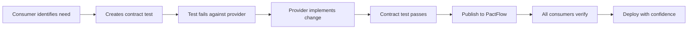

# ADR-013: Contract Testing Strategy for Multi-Platform API Compatibility

- **Status**: Proposed
- **Date**: 2025-06-12
- **Authors**: @bookmarkai-qa, @bookmarkai-platform
- **Supersedes**: —
- **Superseded by**: —
- **Related**: ADR-012 (API Style Guide), ADR-011 (Mobile/Extension Integration), ADR-004 (Shares Endpoint)

---

## 1 — Context

Task 1.13 requires implementing contract tests to ensure compatibility between our API Gateway and four distinct client platforms: iOS Share Extension (Swift), Android Share Intent (Kotlin), React Native app, and WebExtension (TypeScript).

Current pain points:

- **Silent API Breakages**: Changes to API responses discovered only during manual testing
- **Platform Divergence**: Each platform interprets API contracts slightly differently
- **Offline Queue Contracts**: No validation of queue data structures between platforms
- **Version Coordination**: Difficult to coordinate API changes across multiple teams
- **Native Bridge Testing**: No automated testing of React Native ↔ Native module contracts

With ADR-012 establishing our API conventions, we now need automated enforcement to prevent regression and enable confident API evolution.

---

## 2 — Decision

We will implement a **hybrid contract testing strategy** with OpenAPI as the single source of truth:

### 2.1 Core Technology Stack

| Component                   | Technology                                 | Rationale                                                                           |
| --------------------------- | ------------------------------------------ | ----------------------------------------------------------------------------------- |
| **Schema Source**           | **OpenAPI v3**                             | Single source of truth for all platforms                                            |
| **Code Generation**         | **openapi-generator**                      | TS types, Kotlin data classes, Swift Codable structs from same file                 |
| **HTTP Contracts**          | **Pact** (Consumer-Driven)                 | Better multi-language support, mature ecosystem                                     |
| **Runtime Validation**      | **Ajv** (compiled from OpenAPI)            | Fast JSON Schema validation, works everywhere                                       |
| **Native Bridge Contracts** | **TypeScript Interfaces** + Platform Tests | Real device/simulator testing                                                       |
| **Queue Schema Contracts**  | **JSON Schema** (in OpenAPI)               | Cross-platform validation for offline queues                                        |
| **Contract Broker**         | **PactFlow** (SaaS)                        | If SaaS residency is blocker, self-hostable OSS broker with same API is contingency |
| **Test Matchers**           | **@bookmarkai/test-matchers**              | Shared matchers for uuid(), iso8601DateTime() etc. across JS/JVM/Swift              |

### 2.2 Contract Hierarchy

```
┌─────────────────────────────────────────────────────────┐
│                   Contract Types                         │
├─────────────────────────────────────────────────────────┤
│  Level 1: HTTP API Contracts (Pact)                     │
│  - Request/Response shapes                               │
│  - Status codes and headers                             │
│  - Error response formats (ADR-012)                     │
├─────────────────────────────────────────────────────────┤
│  Level 2: Data Schema Contracts (OpenAPI/JSON Schema)   │
│  - Queue entry formats (iOS/Android/Web)                │
│  - Share data structure                                 │
│  - Authentication token shapes                          │
├─────────────────────────────────────────────────────────┤
│  Level 3: Behavioral Contracts (Custom Tests)           │
│  - Idempotency key handling                            │
│  - Retry/backoff behavior                              │
│  - Offline queue synchronization                        │
└─────────────────────────────────────────────────────────┘
```

### 2.3 Implementation Strategy

#### Phase 1: HTTP Contract Tests (Weeks 1-2)

```typescript
// Consumer contract example (React Native)
// Note: uuid(), iso8601DateTime() imported from @bookmarkai/test-matchers
import { uuid, iso8601DateTime, like, term } from '@bookmarkai/test-matchers';

describe('Shares API Contract', () => {
  describe('POST /v1/shares', () => {
    it('creates a share successfully', async () => {
      await provider.addInteraction({
        state: 'user is authenticated',
        uponReceiving: 'a request to create a share',
        withRequest: {
          method: 'POST',
          path: '/v1/shares',
          headers: {
            Authorization: term({
              matcher: '^Bearer .+',
              generate: 'Bearer eyJ...',
            }),
            'Idempotency-Key': uuid(),
            'Content-Type': 'application/json',
          },
          body: {
            url: 'https://www.tiktok.com/@user/video/123',
          },
        },
        willRespondWith: {
          status: 202,
          headers: {
            'Content-Type': 'application/json',
            'X-Request-ID': uuid(),
          },
          body: like({
            success: true,
            data: {
              id: uuid(),
              url: 'https://www.tiktok.com/@user/video/123',
              platform: 'tiktok',
              status: oneOf(['pending', 'processing']),
              createdAt: iso8601DateTime(),
            },
          }),
        },
      });
    });
  });
});
```

#### Phase 2: Queue Schema Contracts (Weeks 2-3)

```yaml
# OpenAPI components/schemas/ShareQueueEntry
ShareQueueEntry:
  type: object
  required: [id, url, createdAt, status]
  properties:
    id:
      type: string
      pattern: '^[0-9A-HJKMNP-TV-Z]{26}$' # Correct Crockford base32 ULID
      description: Unique identifier (ULID) - case sensitive
    url:
      type: string
      format: uri
      pattern: '^https?://.+$' # Basic URI format; domain validation server-side
      description: Allowed domains validated server-side
    createdAt:
      type: string
      format: date-time
    status:
      type: string
      enum: [PENDING, UPLOADING, UPLOADED, FAILED, NEEDS_AUTH]
    retryCount:
      type: integer
      minimum: 0
      maximum: 5
```

#### Phase 3: Platform-Specific Testing

| Platform         | Contract Test Location                    | Test Runner          |
| ---------------- | ----------------------------------------- | -------------------- |
| **iOS**          | `ios/BookmarkAITests/ContractTests/`      | XCTest + Pact Swift  |
| **Android**      | `android/app/src/test/contractTests/`     | JUnit + Pact JVM     |
| **React Native** | `packages/mobile/src/__contracts__/`      | Jest + Pact JS       |
| **WebExtension** | `packages/extension/src/__contracts__/`   | Vitest + Pact JS     |
| **API Gateway**  | `packages/api-gateway/src/__contracts__/` | Jest + Pact Verifier |

### 2.4 Contract Evolution Process



### 2.5 Provider State Setup

Provider states must be explicitly defined and implemented to prevent "green but lying" tests:

```typescript
// Provider state handlers (API Gateway)
const stateHandlers = {
  'user is authenticated': async () => {
    // 1. Seed test user in DB
    await db.insert(users).values({ id: 'test-123', email: 'test@example.com' });
    // 2. Generate valid JWT
    const token = await jwtService.sign({ sub: 'test-123' });
    // 3. Configure auth middleware to accept token
    mockAuthMiddleware.acceptToken(token);
  },

  'user has exceeded rate limit': async () => {
    // Configure rate limiter to reject requests
    await redis.set('rate-limit:test-123', '10', 'EX', 60);
  },

  // Build fails if state handler is undefined
  'unknown state': () => {
    throw new Error('Provider state "unknown state" not implemented');
  },
};
```

### 2.6 Backward Compatibility Strategy

```typescript
// Contract versioning with ADR-012 compliance
interface ContractVersion {
  version: '1.0' | '1.1'; // Matches API version
  deprecatedFields?: string[];
  breakingChanges?: {
    date: string;
    description: string;
    migration: string;
  }[];
}
```

#### 2.6.1 Deprecation Standard Operating Procedure

1. **Dual-write period**: New and old fields populated for 1 release cycle
2. **Deprecation headers**: Add `X-API-Deprecated-On: 2025-08-01` to responses
3. **Removal timeline**: Fields removed after 60 days minimum
4. **CI enforcement**: Build fails if field deleted without migration note in OpenAPI:

```yaml
# OpenAPI deprecation example
url:
  type: string
  deprecated: true
  x-removal-date: '2025-08-01'
  x-migration-guide: "Use 'shareUrl' field instead"
shareUrl:
  type: string
  description: "Replaces deprecated 'url' field"
```

### 2.7 Native Bridge Contract Testing

Native bridge contracts require real device/simulator testing, not just Jest mocks:

```swift
// iOS ShareHandlerBridgeTests.swift
class ShareHandlerBridgeContractTests: XCTestCase {
    var bridge: RCTBridge!
    var shareHandler: ShareHandler!

    override func setUp() {
        super.setUp()
        // Initialize React Native test harness
        bridge = RCTBridge(delegate: self, launchOptions: nil)
        shareHandler = bridge.module(for: ShareHandler.self) as? ShareHandler
    }

    func testFlushQueueReturnsValidSchema() async throws {
        // Add test items to queue
        let testShare = ShareQueueItem(
            id: ULID().ulidString,
            url: "https://example.com/test",
            createdAt: Date(),
            status: .pending
        )
        try await shareHandler.addToQueue(testShare)

        // Call bridge method
        let promise = MockPromise()
        shareHandler.flushQueue(promise.resolve, promise.reject)
        let result = try await promise.value as! [[String: Any]]

        // Validate against JSON Schema
        let validator = try JSONSchemaValidator(schema: "ShareQueueEntry")
        XCTAssertNoThrow(try validator.validate(result))
    }
}
```

```kotlin
// Android ShareHandlerBridgeTests.kt
@RunWith(AndroidJUnit4::class)
class ShareHandlerBridgeContractTests {
    private lateinit var reactContext: ReactApplicationContext
    private lateinit var shareHandler: ShareHandlerModule

    @Before
    fun setup() {
        reactContext = ReactApplicationContext(getApplicationContext())
        shareHandler = ShareHandlerModule(reactContext)
    }

    @Test
    fun testFlushQueueReturnsValidSchema() = runTest {
        // Add test item
        val testShare = ShareQueueItem(
            id = ULID.random(),
            url = "https://example.com/test",
            createdAt = Instant.now(),
            status = ShareStatus.PENDING
        )
        shareHandler.addToQueue(testShare)

        // Call bridge method and validate
        val result = shareHandler.flushQueue()
        val validator = JSONSchemaValidator.fromResource("ShareQueueEntry.json")
        assertTrue(validator.validate(result))
    }
}
```

### 2.8 CI/CD Integration

```yaml
# .github/workflows/contract-tests.yml
name: Contract Tests
on: [push, pull_request]

jobs:
  consumer-contracts:
    strategy:
      matrix:
        platform: [react-native, webextension, ios, android]
    steps:
      - name: Run consumer contract tests
        run: npm run test:contracts:${{ matrix.platform }}

      - name: Publish contracts to PactFlow
        run: |
          npx pact-broker publish pacts \
            --consumer-app-version=${{ github.sha }} \
            --tag=${{ github.ref_name }}

  provider-verification:
    needs: consumer-contracts
    steps:
      - name: Verify all contracts
        run: npm run test:contracts:verify

      - name: Can-i-deploy check
        run: |
          npx pact-broker can-i-deploy \
            --pacticipant=api-gateway \
            --version=${{ github.sha }} \
            --to-environment=production
```

---

## 3 — Options Considered

| Option                     | Pros                                                | Cons                                      | Decision        |
| -------------------------- | --------------------------------------------------- | ----------------------------------------- | --------------- |
| **A. Pact (CDC) - Chosen** | Multi-language support, mature tooling, SaaS broker | Learning curve, requires all teams buy-in | ✅ Chosen       |
| **B. Dredd (OpenAPI)**     | Simple setup, uses existing OpenAPI                 | Limited to HTTP, no consumer contracts    | ❌ Too limiting |
| **C. Custom Framework**    | Perfect fit, full control                           | High maintenance, reinventing wheel       | ❌ Too costly   |
| **D. No Contract Tests**   | No effort required                                  | API breaks discovered in production       | ❌ Unacceptable |

---

## 4 — Implementation Plan

### Foundation Phase (Weeks 1-2)

- [ ] Set up PactFlow account and CI integration
- [ ] Create @bookmarkai/test-matchers package
- [ ] Configure OpenAPI → code generation pipeline
- [ ] Create first Pact test for shares endpoint (React Native)
- [ ] Implement provider verification in API Gateway
- [ ] Document contract testing guidelines

### Platform Rollout (Weeks 3-6)

- [ ] iOS Share Extension Pact tests (Swift) with real bridge testing
- [ ] Android Share Intent Pact tests (Kotlin) with real bridge testing
- [ ] WebExtension Pact tests (TypeScript)
- [ ] Queue schema validation tests from OpenAPI
- [ ] Provider state discipline enforcement

### Hard Gate Enforcement (Week 7)

- [ ] Enable "can-i-deploy" as required check
- [ ] Block PRs without contract coverage
- [ ] Implement deprecation policy automation
- [ ] Performance baseline establishment

---

## 5 — Consequences

### Positive

- **Single Source of Truth**: OpenAPI drives all schema definitions
- **Early Detection**: API breaking changes caught before deployment
- **Real Testing**: Native bridges tested on actual devices/simulators
- **Living Documentation**: Contracts serve as API documentation
- **Safe Evolution**: Formal deprecation process prevents breaking changes

### Negative

- **Initial Investment**: ~7 weeks for full implementation
- **Test Maintenance**: Contracts must be updated with API changes
- **CI Time**: Adds ~5-10 minutes to pipeline (target: ≤10min P90)
- **Cultural Shift**: Requires consumer-driven mindset

### Risk Mitigation

- Gradual rollout starting with critical endpoints
- OpenAPI-first approach reduces manual work
- Regular "Contract Testing Office Hours" for support
- Slack alerts for contract test failures

---

## 6 — Success Metrics

| Metric                        | Target                      | Measurement                      |
| ----------------------------- | --------------------------- | -------------------------------- |
| **Coverage**                  | 100% of critical endpoints¹ | Contract tests / Total endpoints |
| **Break Prevention**          | 0 production API breaks     | Incident tracking                |
| **Developer Velocity**        | No slowdown after week 7    | Sprint velocity comparison       |
| **Cross-Platform Bugs**       | 50% reduction               | Bug tracker analysis             |
| **Time to Detect**            | <5 minutes                  | CI pipeline metrics              |
| **Provider Test Performance** | P95 ≤ 300ms                 | Test execution monitoring        |
| **CI Duration**               | ≤10min (P90)                | GitHub Actions metrics           |

¹Critical endpoints: `/v1/shares`, `/v1/auth/*`, `/v1/users/*`, `/v1/operations/*`

---

## 7 — Team Responsibilities

| Team         | Responsibilities                                              |
| ------------ | ------------------------------------------------------------- |
| **Backend**  | Provider verification, OpenAPI maintenance, state handlers    |
| **Mobile**   | iOS/Android consumer contracts, native bridge tests           |
| **Frontend** | WebExtension/React Native consumer contracts                  |
| **QA**       | Contract testing strategy, tooling, training, matcher library |
| **DevOps**   | CI/CD integration, PactFlow setup, performance monitoring     |

---

## 8 — Migration Strategy

### From Current State

1. Define all schemas in OpenAPI v3 spec
2. Generate types for all platforms from OpenAPI
3. Start with `/v1/shares` endpoint (already stable)
4. Add contracts for each new endpoint going forward
5. Retrofit contracts for existing endpoints by priority
6. Enforce "no merge without contracts" policy by Week 7

### Future Evolution

- GraphQL contract testing when we migrate (Phase 4)
- WebSocket/SSE event contracts
- Performance contracts (response time SLAs)
- Security contracts (auth flows)

---

## 9 — Example Contract Test (Complete)

```typescript
// Complete example: WebExtension testing share creation
// Uses generated types from OpenAPI and shared matchers
import { BookmarkAIClient } from '@bookmarkai/sdk'; // Generated from OpenAPI
import { uuid, iso8601DateTime, like, term } from '@bookmarkai/test-matchers';

describe('WebExtension Shares Contract', () => {
  const provider = new Pact({
    consumer: 'bookmarkai-webextension',
    provider: 'bookmarkai-api-gateway',
    pactfileWriteMode: 'merge',
  });

  beforeAll(() => provider.setup());
  afterAll(() => provider.finalize());

  describe('Share Creation Flow', () => {
    it('handles successful share with metadata', async () => {
      // State setup
      await provider.addInteraction({
        state: 'user with ID 123 exists and is authenticated',
        uponReceiving: 'a request to save a TikTok video',
        withRequest: {
          method: 'POST',
          path: '/v1/shares',
          headers: {
            Authorization: term({
              matcher: '^Bearer [A-Za-z0-9-_]+\\.[A-Za-z0-9-_]+\\.[A-Za-z0-9-_]+$',
              generate: 'Bearer eyJ...',
            }),
            'Idempotency-Key': uuid('550e8400-e29b-41d4-a716-446655440000'),
            'Content-Type': 'application/json',
            'X-Request-ID': uuid(),
          },
          body: {
            url: 'https://www.tiktok.com/@user/video/7234567890123456789',
            metadata: like({
              title: 'Funny Cat Video',
              favicon: 'https://www.tiktok.com/favicon.ico',
            }),
          },
        },
        willRespondWith: {
          status: 202,
          headers: {
            'Content-Type': 'application/json',
            'X-Request-ID': uuid(),
          },
          body: {
            success: true,
            data: like({
              id: uuid('123e4567-e89b-12d3-a456-426614174000'),
              url: 'https://www.tiktok.com/@user/video/7234567890123456789',
              platform: 'tiktok',
              status: 'pending',
              createdAt: iso8601DateTime(),
              metadata: like({
                title: 'Funny Cat Video',
                favicon: 'https://www.tiktok.com/favicon.ico',
              }),
            }),
            meta: like({
              requestId: uuid(),
              version: '1.0',
            }),
          },
        },
      });

      // Test execution using generated SDK
      const client = new BookmarkAIClient({ baseURL: provider.mockService.baseUrl });
      const response = await client.shares.create({
        url: 'https://www.tiktok.com/@user/video/7234567890123456789',
        metadata: {
          title: 'Funny Cat Video',
          favicon: 'https://www.tiktok.com/favicon.ico',
        },
      });

      // Assertions
      expect(response.success).toBe(true);
      expect(response.data.platform).toBe('tiktok');
      expect(response.data.status).toBe('pending');
    });
  });
});
```

---

## 10 — Links & References

- Pact Documentation → https://docs.pact.io/
- PactFlow → https://pactflow.io/
- OpenAPI Generator → https://openapi-generator.tech/
- Contract Testing at Spotify → https://engineering.atspotify.com/2021/07/12/contract-testing-at-spotify/
- Consumer-Driven Contracts → https://martinfowler.com/articles/consumerDrivenContracts.html
- ADR-012 → API Style Guide and Conventions
- Task 1.13 → Contract testing requirement source
