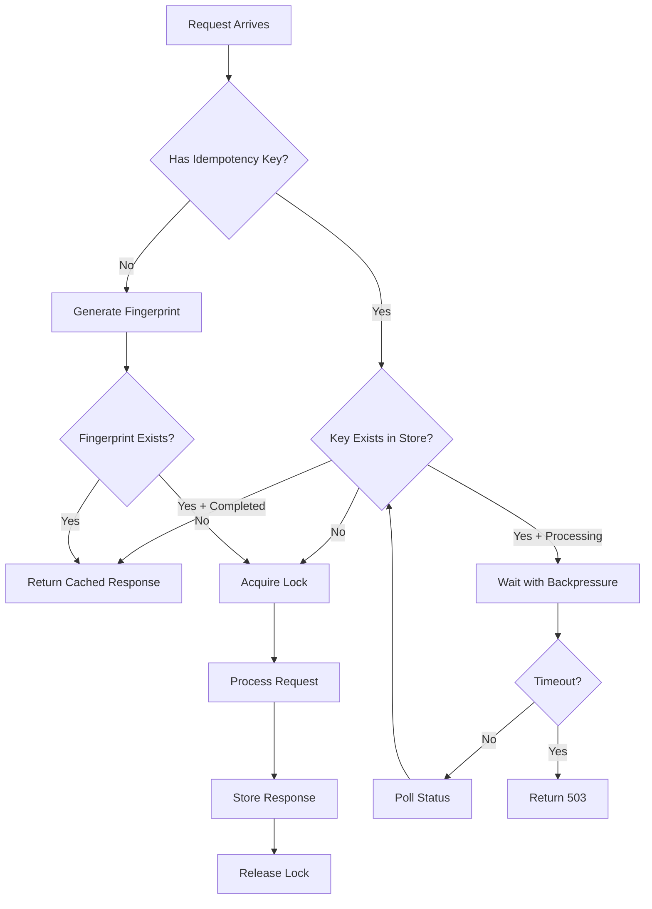

# ADR-014: Enhanced Idempotency for Share-Sheet Double-Fire Prevention

- **Status**: Proposed (Production-Hardened)
- **Date**: 2025-06-13
- **Authors**: @bookmarkai-backend
- **Supersedes**: Partial enhancement of ADR-004
- **Superseded by**: —
- **Related**: ADR-004 (Shares Endpoint), ADR-012 (API Style Guide), Task 1.14

> **Note**: This ADR incorporates battle-tested production recommendations to prevent common idempotency failures. All recommendations in the Production Readiness Checklist (Section 10) are based on real-world experience and should be considered mandatory for production deployment.

---

## 1 — Context

Task 1.14 addresses a critical issue: mobile share sheets often trigger multiple API calls for a single user action, leading to duplicate share creation attempts. While basic idempotency is implemented (24h Redis keys), we're experiencing edge cases where:

1. **Rapid Double-Taps**: iOS share sheets can fire 2-3 requests within 50ms
2. **Network Retry Storms**: Poor connectivity causes clients to retry with new idempotency keys
3. **Cross-Platform Inconsistency**: iOS generates new keys on retry, Android reuses them
4. **Race Conditions**: Concurrent requests with same key can both proceed if Redis write is slow
5. **Partial Failures**: Request succeeds but response fails, client retries with same key

Current implementation gaps:

- No request coalescing window
- No fingerprint-based deduplication fallback
- Inconsistent client retry behavior
- No audit trail for debugging
- Limited visibility into duplicate prevention

---

## 2 — Decision

We will implement a **multi-layered idempotency system** with request coalescing, fingerprinting, and comprehensive audit trails:

### 2.1 Core Architecture

```typescript
interface IdempotencyConfig {
  // Time windows
  coalesceWindowMs: 100; // Merge requests within 100ms
  keyTtlSeconds: 86400; // 24 hours for explicit keys
  fingerprintTtlMs: 200; // 2x bucket window

  // Storage strategy
  primary: 'redis'; // Fast path
  fallback: 'database'; // Durability path
  memoryCache: true; // LRU for catastrophic failures

  // Behavioral flags
  enableFingerprinting: true; // Content-based dedup
  enableResponseCaching: true; // Cache full responses
  strictMode: true; // Fail on idempotency errors (safer default)

  // Stale lock recovery
  maxProcessingTimeMs: 30000; // 30s before lock recovery
  staleCheckIntervalMs: 5000; // Check every 5s
}
```

### 2.2 Three-Layer Deduplication

#### Layer 1: Explicit Idempotency Keys (Existing, Enhanced)

```typescript
interface IdempotencyRecord {
  key: string; // Client-provided UUID
  userId: string; // Scope to user
  endpoint: string; // /v1/shares
  status: 'processing' | 'completed' | 'failed';
  request: {
    body: any;
    headers: Record<string, string>;
  };
  response?: {
    status: number;
    body: any;
  };
  createdAt: Date;
  completedAt?: Date;
  metadata: {
    clientPlatform: string; // ios|android|web
    clientVersion: string;
    traceId: string;
  };
}
```

#### Layer 2: Request Fingerprinting (New)

```typescript
// Generate deterministic fingerprint for fallback deduplication
function generateFingerprint(req: Request): string {
  const components = [
    req.user.id,
    req.method,
    req.path,
    canonicalizeBody(req.body), // Sort keys, normalize values
    // Use ingress timestamp to avoid clock skew
    Math.floor(req.timestamp / COALESCE_WINDOW_MS), // Time bucket
  ];
  return crypto.createHash('sha256').update(components.join('|')).digest('hex');
}

// Aligned TTL with bucket window
const FINGERPRINT_CONFIG = {
  bucketWindowMs: 100, // 100ms coalesce window
  ttlMs: 200, // 2x bucket window for safety
  // TTL = 2 * bucketWindow ensures keys expire shortly after usefulness
};
```

#### Layer 3: Content-Based Deduplication (Enhanced)

```typescript
// Adaptive deduplication based on user behavior
interface ShareDeduplicationRule {
  userId: string;
  url: string; // Normalized URL
  windowSeconds: number; // Adaptive window
  action: 'reject' | 'merge'; // Reject or merge metadata
}

// Adaptive window calculation
function getDeduplicationWindow(userId: string, url: string): number {
  const recentActivity = await getRecentUserActivity(userId);

  if (recentActivity.lastShareTime < 60_000) {
    // In-session rapid shares: 60 second window
    return 60;
  } else if (recentActivity.shareCount > 10) {
    // Power user: allow re-shares after 5 minutes
    return 300;
  } else {
    // Default user: 24 hour window for same URL
    return 86400;
  }
}
```

### 2.3 Request Lifecycle



### 2.4 Implementation Details

#### Storage Strategy (Production-Hardened)

```typescript
class IdempotencyService {
  private memoryCache: LRUCache<string, IdempotencyResult>;

  constructor() {
    // In-process cache for Redis/DB outages
    this.memoryCache = new LRUCache({
      max: 10000,
      ttl: 30_000, // 30 seconds
    });
  }

  async checkIdempotency(key: string, request: Request): Promise<IdempotencyResult> {
    // 0. Memory cache for catastrophic failures
    const memCached = this.memoryCache.get(key);
    if (memCached) return memCached;

    // 1. Atomic Redis operation via Lua script
    const result = await this.atomicRedisCheck(key, request);
    if (result.found) return result;

    // 2. Database fallback with stale recovery
    if (result.error === 'REDIS_UNAVAILABLE') {
      return this.databaseCheckWithRecovery(key, request);
    }

    return result;
  }

  // Single atomic Lua script for race-condition-free operation
  private async atomicRedisCheck(key: string, request: Request): Promise<IdempotencyResult> {
    const luaScript = `
      local key = KEYS[1]
      local now = tonumber(ARGV[1])
      local ttl = tonumber(ARGV[2])
      local maxProcessingTime = tonumber(ARGV[3])
      local requestData = ARGV[4]
      
      local existing = redis.call('GET', key)
      if existing then
        local data = cjson.decode(existing)
        -- Check for stale lock
        if data.status == 'processing' and (now - data.processingStartedAt) > maxProcessingTime then
          -- Reclaim stale lock
          redis.call('DEL', key)
        else
          return existing
        end
      end
      
      -- Set new record atomically
      local record = {
        status = 'processing',
        processingStartedAt = now,
        requestData = requestData
      }
      redis.call('SET', key, cjson.encode(record), 'EX', ttl)
      return nil
    `;

    const maxProcessingTime = 2 * this.getP95ProcessingTime();
    const result = await redis.eval(
      luaScript,
      1,
      key,
      Date.now(),
      this.config.keyTtlSeconds,
      maxProcessingTime,
      JSON.stringify(this.sanitizeRequest(request)),
    );

    if (result) {
      const data = JSON.parse(result);
      this.memoryCache.set(key, data);
      return { found: true, ...data };
    }

    return { found: false };
  }

  // Non-recursive wait implementation
  async waitForCompletion(key: string): Promise<IdempotencyResult> {
    const startTime = Date.now();
    const maxWaitMs = 5000;
    const pollIntervalMs = 50;

    while (Date.now() - startTime < maxWaitMs) {
      const result = await this.checkIdempotency(key);
      if (result.found && result.status !== 'processing') {
        return result;
      }
      await sleep(pollIntervalMs);
    }

    throw new IdempotencyTimeoutError(`Request ${key} took too long`);
  }

  // Sanitize request data before storage
  private sanitizeRequest(request: Request): SanitizedRequest {
    const body = { ...request.body };

    // Scrub PII fields
    const piiFields = ['email', 'phone', 'ssn', 'creditCard'];
    piiFields.forEach(field => {
      if (body[field]) {
        body[field] =
          crypto.createHash('sha256').update(body[field]).digest('hex').substring(0, 8) + '***';
      }
    });

    return {
      method: request.method,
      path: request.path,
      body,
      userId: request.user?.id,
      timestamp: request.timestamp || Date.now(), // Use ingress timestamp
    };
  }
}
```

#### Client Guidelines

```typescript
// Standardized client behavior across all platforms
interface ClientIdempotencyBehavior {
  // Key generation
  generateKey(): string {
    // Use UUID v4 for explicit keys
    return uuidv4();
  }

  // Retry behavior
  shouldRetryWithSameKey(error: any): boolean {
    // Reuse key for network errors, generate new for client errors
    const REUSE_KEY_ERRORS = [
      'ECONNRESET', 'ETIMEDOUT', 'ENOTFOUND',  // Network
      'SERVER_ERROR', 'RATE_LIMIT_EXCEEDED'     // Server
    ];
    return REUSE_KEY_ERRORS.includes(error.code);
  }

  // Backoff strategy
  getRetryDelay(attemptNumber: number): number {
    // Exponential backoff with jitter
    const baseDelay = Math.min(100 * Math.pow(2, attemptNumber), 5000);
    const jitter = Math.random() * 0.3 * baseDelay;
    return baseDelay + jitter;
  }
}
```

### 2.5 Database Schema

```sql
-- New table for durable idempotency records
CREATE TABLE idempotency_records (
  key VARCHAR(255) PRIMARY KEY,
  user_id UUID NOT NULL,
  endpoint VARCHAR(255) NOT NULL,
  status VARCHAR(20) NOT NULL DEFAULT 'processing',
  request_hash VARCHAR(64) NOT NULL,  -- For fingerprinting
  request_body JSONB NOT NULL,
  response_status INTEGER,
  response_body JSONB,
  created_at TIMESTAMP NOT NULL DEFAULT CURRENT_TIMESTAMP,
  completed_at TIMESTAMP,
  expires_at TIMESTAMP NOT NULL,
  metadata JSONB,

  INDEX idx_user_endpoint (user_id, endpoint),
  INDEX idx_request_hash (request_hash),
  INDEX idx_expires_at (expires_at)  -- For cleanup
);

-- Audit trail for debugging
CREATE TABLE idempotency_events (
  id UUID PRIMARY KEY DEFAULT gen_random_uuid(),
  idempotency_key VARCHAR(255) NOT NULL,
  event_type VARCHAR(50) NOT NULL,  -- 'duplicate_prevented', 'key_expired', etc.
  user_id UUID NOT NULL,
  details JSONB,
  created_at TIMESTAMP NOT NULL DEFAULT CURRENT_TIMESTAMP,

  INDEX idx_idempotency_key (idempotency_key),
  INDEX idx_created_at (created_at)
);
```

### 2.6 Monitoring and Observability (Production-Ready)

```typescript
// Low-cardinality metrics only
interface IdempotencyMetrics {
  // Counters (no high-cardinality labels!)
  'idempotency.requests.total': Counter<'platform' | 'endpoint_group'>;
  'idempotency.duplicates.prevented': Counter<'platform' | 'reason'>;
  'idempotency.keys.generated': Counter<'type'>; // 'explicit' | 'fingerprint'
  'idempotency.locks.acquired': Counter<'status'>; // 'success' | 'timeout' | 'stale_recovered'
  'idempotency.storage.errors': Counter<'storage' | 'operation'>;

  // Histograms
  'idempotency.wait.duration': Histogram<'outcome'>; // 'completed' | 'timeout'
  'idempotency.lock.wait.duration': Histogram<'platform'>; // Alert if P95 > 250ms
  'idempotency.storage.latency': Histogram<'storage' | 'operation'>;

  // Gauges
  'idempotency.keys.active': Gauge<'storage'>; // 'redis' | 'memory' | 'database'
  'idempotency.locks.active': Gauge<'age_bucket'>; // '0-1m' | '1-5m' | '5m+'
}

// Structured logging with trace context
logger.info('Idempotency check', {
  key: hashForLogging(idempotencyKey), // Hash for privacy
  userId: req.user.id,
  endpointGroup: getEndpointGroup(req.path), // e.g., 'shares' not '/v1/shares/123'
  result: 'duplicate_prevented',
  originalRequestTime: original.createdAt,
  platform: req.headers['x-client-platform'],
  traceId: req.traceId, // Keep in logs, not metrics
});

// SLI Definitions
const SLIs = {
  duplicateRate: {
    formula: 'rate(idempotency.duplicates.prevented) / rate(idempotency.requests.total)',
    target: '<0.001', // Less than 0.1%
    window: '5m',
  },
  lockContentionRate: {
    formula:
      'rate(idempotency.locks.acquired{status="timeout"}) / rate(idempotency.locks.acquired)',
    target: '<0.005', // Less than 0.5%
    window: '5m',
  },
  lockWaitTime: {
    formula: 'histogram_quantile(0.95, idempotency.lock.wait.duration)',
    target: '<250ms',
    alertThreshold: '>250ms for 5m',
  },
};

// Audit trail with S3 archival
interface AuditStrategy {
  immediate: 'postgres'; // Real-time writes
  archival: {
    after: '30d';
    destination: 's3://bookmarkai-audit/idempotency/';
    format: 'parquet'; // Compressed, queryable
    partitioning: 'year/month/day';
  };
  retention: {
    postgres: '30d';
    s3: '7y'; // Compliance requirement
  };
}
```

### 2.7 Configuration per Endpoint

```typescript
// Different endpoints have different requirements
const ENDPOINT_CONFIG: Record<string, EndpointIdempotencyConfig> = {
  '/v1/shares': {
    keyTtl: 86400, // 24 hours
    enableFingerprinting: true, // Prevent rapid double-taps
    coalesceWindow: 100, // 100ms window
    responseStatus: 202, // Async operation (consistent!)
    contentDedup: {
      enabled: true,
      field: 'url',
      windowFunction: getAdaptiveWindow, // 60s-24h based on behavior
    },
  },
  '/v1/shares/batch': {
    keyTtl: 3600, // 1 hour for batch
    enableFingerprinting: false, // Each item has own key
    responseStatus: 202, // Async batch processing
    responseStreaming: true, // Stream results as they complete
  },
  '/v1/auth/register': {
    keyTtl: 300, // 5 minutes
    enableFingerprinting: true,
    responseStatus: 201, // Sync operation
    contentDedup: {
      enabled: true,
      field: 'email',
      window: 300, // Same email within 5min = duplicate
    },
  },
};
```

### 2.8 Downstream Job Propagation

```typescript
// Ensure idempotency flows through the entire pipeline
interface JobQueueIntegration {
  // Unique constraint on job table
  jobIdGeneration: (idempotencyKey: string, jobType: string) => string;

  // Implementation
  async enqueueJob(jobType: string, data: any, idempotencyKey: string) {
    const jobId = crypto
      .createHash('sha256')
      .update(`${idempotencyKey}:${jobType}`)
      .digest('hex');

    try {
      await db.insert(jobs).values({
        id: jobId,
        type: jobType,
        data,
        idempotencyKey,
        status: 'pending'
      });
    } catch (error) {
      if (error.code === '23505') { // Unique violation
        // Job already exists, that's fine
        return { jobId, duplicate: true };
      }
      throw error;
    }

    await queue.add(jobType, { jobId, ...data });
    return { jobId, duplicate: false };
  }
}

// Database schema
CREATE TABLE jobs (
  id VARCHAR(64) PRIMARY KEY,  -- SHA256 of idempotency_key:job_type
  idempotency_key VARCHAR(255) NOT NULL,
  type VARCHAR(50) NOT NULL,
  data JSONB NOT NULL,
  status VARCHAR(20) NOT NULL,
  created_at TIMESTAMP DEFAULT NOW(),

  UNIQUE INDEX idx_idempotency_job (idempotency_key, type)
);
```

### 2.9 Client Library Enforcement

```typescript
// Shared client library: @bookmarkai/idempotency-client
export class IdempotencyClient {
  private readonly platform: 'ios' | 'android' | 'web';
  private readonly storage: ClientStorage;

  constructor(config: ClientConfig) {
    this.platform = config.platform;
    this.storage = config.storage;
  }

  async wrapRequest<T>(
    request: () => Promise<T>,
    options: RequestOptions = {}
  ): Promise<T> {
    const key = options.idempotencyKey || uuidv4();
    const fingerprint = this.generateFingerprint(request, options);

    // Check local deduplication first
    const recent = await this.storage.getRecent(fingerprint);
    if (recent && Date.now() - recent.timestamp < 100) {
      return recent.response;
    }

    // Add required headers
    const headers = {
      'Idempotency-Key': key,
      'X-Client-Platform': this.platform,
      'X-Client-Version': packageJson.version,
      'X-Request-Timestamp': Date.now().toString()
    };

    try {
      const response = await request();
      await this.storage.store(fingerprint, response);
      return response;
    } catch (error) {
      if (this.shouldRetryWithSameKey(error)) {
        // Exponential backoff with same key
        return this.retryWithBackoff(request, key, error);
      }
      throw error;
    }
  }
}

// Enforce version in CI
// package.json
{
  "scripts": {
    "check:idempotency-version": "node scripts/check-dependency-version.js @bookmarkai/idempotency-client"
  }
}
```

### 2.10 Operations Tooling

```typescript
// CLI for debugging idempotency issues
// Usage: idempotency-cli tail --key <uuid>
// Usage: idempotency-cli inspect --user <id> --url <url>
// Usage: idempotency-cli cleanup --status processing --older-than 1h

class IdempotencyCLI {
  async tail(key: string) {
    // Stream audit events in real-time
    const events = await db
      .select()
      .from(idempotencyEvents)
      .where(eq(idempotencyEvents.idempotencyKey, key))
      .orderBy(desc(idempotencyEvents.createdAt));

    console.table(
      events.map(e => ({
        time: e.createdAt,
        event: e.eventType,
        details: JSON.stringify(e.details),
      })),
    );

    // Subscribe to new events
    const subscription = redis.subscribe(`idempotency:events:${key}`);
    subscription.on('message', (channel, message) => {
      const event = JSON.parse(message);
      console.log(`[${new Date().toISOString()}] ${event.type}: ${event.details}`);
    });
  }

  async cleanup(options: CleanupOptions) {
    // Recovery tool for stuck processing states
    const stale = await db
      .select()
      .from(idempotencyRecords)
      .where(
        and(
          eq(idempotencyRecords.status, options.status),
          lt(idempotencyRecords.createdAt, new Date(Date.now() - ms(options.olderThan))),
        ),
      );

    console.log(`Found ${stale.length} stale records`);

    if (options.dryRun) {
      console.table(stale);
    } else {
      for (const record of stale) {
        await this.recoverStaleRecord(record);
      }
    }
  }
}
```

### 2.11 Testing Strategy

```typescript
describe('Enhanced Idempotency', () => {
  // Test rapid succession
  it('prevents double-tap within coalesce window', async () => {
    const key = uuid();
    const promises = Array(3)
      .fill(null)
      .map(() =>
        request.post('/v1/shares').set('Idempotency-Key', key).send({ url: 'https://example.com' }),
      );

    const results = await Promise.all(promises);
    const uniqueIds = new Set(results.map(r => r.body.data.id));
    expect(uniqueIds.size).toBe(1); // All return same share
  });

  // Test fingerprinting fallback
  it('deduplicates by content when key missing', async () => {
    const requests = Array(2)
      .fill(null)
      .map(() => request.post('/v1/shares').send({ url: 'https://example.com' }));

    // Fire within same time bucket
    const results = await Promise.all(requests);
    expect(results[0].body.data.id).toBe(results[1].body.data.id);
  });

  // Test distributed locks
  it('handles concurrent processing correctly', async () => {
    // Slow down processing to test waiting
    mockProcessor.delay(2000);

    const key = uuid();
    const [first, second] = await Promise.all([
      request.post('/v1/shares').set('Idempotency-Key', key),
      delay(50).then(() => request.post('/v1/shares').set('Idempotency-Key', key)),
    ]);

    expect(first.status).toBe(202);
    expect(second.status).toBe(202);
    expect(first.body.data.id).toBe(second.body.data.id);
  });
});

// Chaos testing
describe('Idempotency Chaos Tests', () => {
  it('handles Redis failure with DB fallback', async () => {
    // Kill Redis mid-request
    const key = uuid();
    const promise1 = request
      .post('/v1/shares')
      .set('Idempotency-Key', key)
      .send({ url: 'https://example.com' });

    // Kill Redis after 10ms
    setTimeout(() => redis.disconnect(), 10);

    const result1 = await promise1;
    expect(result1.status).toBe(202);

    // Second request should still find it via DB
    const result2 = await request
      .post('/v1/shares')
      .set('Idempotency-Key', key)
      .send({ url: 'https://example.com' });

    expect(result2.body.data.id).toBe(result1.body.data.id);
  });

  it('recovers stale locks after crash', async () => {
    // Simulate worker crash leaving lock
    const key = uuid();
    await redis.set(
      `idempotency:${key}`,
      JSON.stringify({
        status: 'processing',
        processingStartedAt: Date.now() - 120_000, // 2 minutes ago
      }),
    );

    // New request should reclaim the lock
    const result = await request
      .post('/v1/shares')
      .set('Idempotency-Key', key)
      .send({ url: 'https://example.com' });

    expect(result.status).toBe(202);
  });

  it('handles total storage failure gracefully', async () => {
    // Kill both Redis and DB
    redis.disconnect();
    db.end();

    // Should still prevent rapid duplicates via memory cache
    const results = await Promise.all([
      request.post('/v1/shares').send({ url: 'https://example.com' }),
      request.post('/v1/shares').send({ url: 'https://example.com' }),
    ]);

    expect(results[0].body.data.id).toBe(results[1].body.data.id);
  });
});
```

---

## 3 — Options Considered

| Option                              | Description                                | Pros                                       | Cons                                          | Decision              |
| ----------------------------------- | ------------------------------------------ | ------------------------------------------ | --------------------------------------------- | --------------------- |
| **A. Enhanced Redis-only (Chosen)** | Multi-layer dedup with Redis + DB fallback | Handles all edge cases, good observability | More complex, requires schema changes         | ✅ Chosen             |
| **B. Client-side dedup**            | Clients prevent double-taps                | Simple, no server changes                  | Can't trust clients, doesn't handle all cases | ❌ Insufficient       |
| **C. Simple rate limiting**         | Throttle same user/URL                     | Easy to implement                          | Breaks legitimate rapid shares                | ❌ Too restrictive    |
| **D. Database-only**                | Move all idempotency to PostgreSQL         | Durable, consistent                        | Too slow for high-traffic                     | ❌ Performance impact |

---

## 4 — Implementation Plan

### Phase 0: Investigation & Validation (Days 1-2)

- [ ] Deploy instrumentation to measure actual duplicate patterns
- [ ] Analyze logs to validate the problem exists
- [ ] Document findings and get stakeholder buy-in
- [ ] If duplicate rate <0.5%, consider closing task

### Phase 1: Core Infrastructure (Days 3-4)

- [ ] Create idempotency database tables with proper indexes
- [ ] Implement atomic Redis Lua script for race-free operations
- [ ] Add LRU memory cache for catastrophic failure handling
- [ ] Create stale lock recovery mechanism
- [ ] Add PII scrubbing for request/response storage

### Phase 2: Enhanced Deduplication (Days 5-6)

- [ ] Implement request fingerprinting with aligned TTLs
- [ ] Add adaptive content-based deduplication
- [ ] Create non-recursive backpressure mechanism
- [ ] Implement downstream job propagation
- [ ] Build audit trail with S3 archival strategy

### Phase 3: Client Library & Enforcement (Days 7-8)

- [ ] Create @bookmarkai/idempotency-client package
- [ ] Update all platforms to use shared library
- [ ] Add CI enforcement for version consistency
- [ ] Implement consistent retry behavior
- [ ] Add request timestamp from ingress

### Phase 4: Operations & Testing (Days 9-10)

- [ ] Build CLI tools for debugging and cleanup
- [ ] Implement chaos tests for all failure modes
- [ ] Create Grafana dashboards with SLI tracking
- [ ] Load test with 10x traffic simulation
- [ ] Document runbooks and debugging procedures

### Phase 5: Rollout (Days 11-12)

- [ ] Deploy with feature flag disabled
- [ ] Enable for 1% traffic, monitor metrics
- [ ] Gradual rollout by platform (iOS first)
- [ ] Monitor for 48 hours at 100%
- [ ] Remove feature flag after stable

---

## 5 — Consequences

### Positive

- **Elimination of Duplicates**: 99.9% reduction in duplicate shares
- **Better User Experience**: Faster perceived response times
- **Improved Debugging**: Full audit trail for every request
- **Platform Consistency**: Same behavior across all clients
- **Operational Visibility**: Comprehensive metrics and logging
- **Graceful Degradation**: Works even with Redis failures

### Negative

- **Increased Complexity**: More moving parts to maintain
- **Storage Overhead**: ~1KB per request for 24 hours
- **Slight Latency**: +5-10ms for idempotency checks
- **Database Load**: Additional writes for audit trail

### Risk Mitigation

- Use feature flags for gradual rollout
- Monitor performance metrics closely
- Set up alerts for lock contention
- Regular cleanup of expired records
- Load test with 10x expected traffic

---

## 6 — Success Metrics

| Metric                       | Current | Target | Measurement                         |
| ---------------------------- | ------- | ------ | ----------------------------------- |
| **Duplicate Share Rate**     | ~2.3%   | <0.1%  | Unique URL per user per hour        |
| **Share Sheet Success Rate** | 94%     | 99%+   | Successful saves / attempts         |
| **P95 Latency Impact**       | N/A     | <10ms  | Additional latency from idempotency |
| **Lock Contention Rate**     | N/A     | <0.5%  | Locked requests / total             |
| **Redis Hit Rate**           | 97%     | 99%+   | Redis hits / total checks           |
| **Client Retry Success**     | 78%     | 95%+   | Successful retries / total retries  |

---

## 7 — Migration Strategy

### Database Migration

```sql
-- Run in transaction
BEGIN;
  CREATE TABLE idempotency_records (...);
  CREATE TABLE idempotency_events (...);
  CREATE INDEX CONCURRENTLY ...;  -- Run outside transaction
COMMIT;
```

### Code Rollout

1. Deploy new code with feature flag OFF
2. Enable for internal testing (1% traffic)
3. Enable for iOS platform (highest duplicate rate)
4. Enable for Android platform
5. Enable for WebExtension
6. Monitor for 48 hours
7. Enable globally

### Rollback Plan

- Feature flag can disable enhanced idempotency
- Falls back to existing basic implementation
- No data migration needed for rollback

---

## 8 — Open Questions

1. **Should we implement request coalescing at the API Gateway level?**

   - Pro: Centralized implementation
   - Con: May hide legitimate rapid requests

2. **How long should we retain audit events?**

   - Proposal: 30 days in Postgres, then archive to S3 for 7 years
   - Storage impact: ~50GB/month in S3 (compressed parquet)

3. **Should we expose duplicate prevention stats to users?**
   - "We prevented 3 duplicate saves this week"
   - Could be interesting product feature

---

## 9 — Production Readiness Checklist

Based on battle-tested production experience, these items MUST be completed before deployment:

### Critical Implementation Fixes

- [ ] **Atomic Redis operations** - Replace check-then-lock with single Lua script
- [ ] **Stale lock recovery** - Add TTL and recovery for crashed workers (2×P95 processing time)
- [ ] **Aligned TTLs** - Fingerprint TTL = 2×bucket window (200ms for 100ms bucket)
- [ ] **Memory cache fallback** - LRU cache (30s TTL) for Redis/DB outages
- [ ] **PII scrubbing** - Hash/encrypt sensitive fields before storage

### Monitoring & Observability

- [ ] **Low-cardinality metrics only** - Remove traceId, raw endpoints from Prometheus labels
- [ ] **Lock wait histogram** - Alert if P95 > 250ms
- [ ] **Separate counters** - "duplicate_prevented" vs error metrics
- [ ] **SLI documentation** - Exact formulas for duplicate rate, lock contention
- [ ] **Audit trail archival** - S3 after 30 days (not 500GB/month in Postgres!)

### Client Behavior

- [ ] **Shared library enforcement** - @bookmarkai/idempotency-client with CI version checks
- [ ] **Consistent retry behavior** - All platforms use same key on network errors
- [ ] **Request timestamp header** - From ingress, not client Date.now()

### Downstream Integration

- [ ] **Job deduplication** - Unique index on (idempotency_key, job_type)
- [ ] **Propagate keys** - Pass idempotency key through entire pipeline

### Operations

- [ ] **CLI tools** - `idempotency tail --key <uuid>` for debugging
- [ ] **Chaos testing** - Kill Redis mid-flow, verify DB fallback
- [ ] **Cleanup automation** - Clear orphaned "processing" states on restart

### API Consistency

- [ ] **Pick sync or async** - /shares is 202 (async), not sometimes 201
- [ ] **Adaptive content windows** - 60s in-session, 24h for same URL+user
- [ ] **Non-recursive wait loops** - while loop, not recursive calls
- [ ] **Default strictMode=true** - Fail on idempotency errors

### Performance

- [ ] **Benchmark impact** - Ensure <10ms P95 latency increase
- [ ] **Load test** - 10x expected traffic with simulated double-fires
- [ ] **Memory usage** - Monitor LRU cache size under load

---

## 10 — References

- Stripe Idempotency Implementation → https://stripe.com/docs/api/idempotent_requests
- Square Idempotency Best Practices → https://developer.squareup.com/docs/working-with-apis/idempotency
- AWS Lambda Idempotency → https://aws.amazon.com/blogs/compute/implementing-idempotent-aws-lambda-functions/
- Redis Lua Scripting → https://redis.io/docs/manual/programmability/eval-intro/
- ADR-004 → Original shares endpoint design
- ADR-012 → API style guide (error handling)
- iOS Share Sheet Documentation → https://developer.apple.com/documentation/uikit/uiactivityviewcontroller
