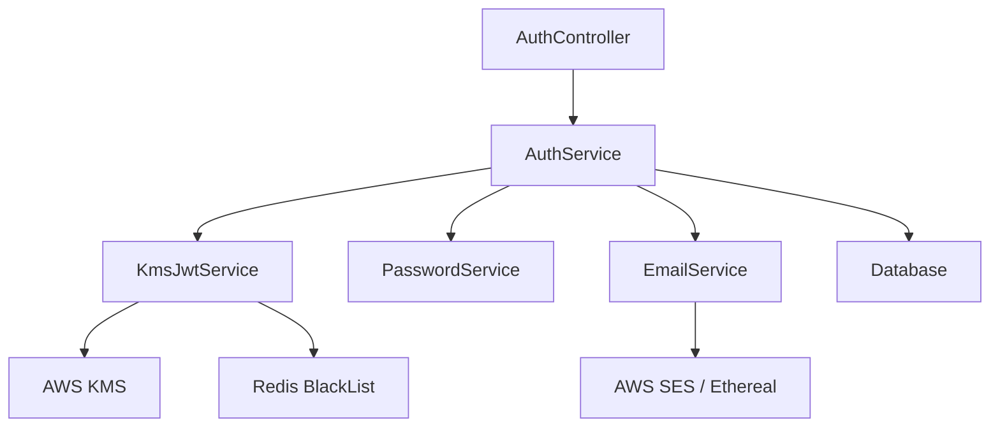

# Authentication Developer Guide

This guide provides technical details for developers working with the BookmarkAI authentication system.

## Architecture Overview

The authentication system follows a JWT-based architecture with refresh tokens, email verification, and password reset capabilities.

**Key Components:**
- `AuthModule`: Main NestJS module for authentication services
- `KmsJwtService`: Handles JWT tokens with AWS KMS integration
- `EmailService`: Manages email sending for verification and password reset
- `PasswordService`: Handles secure password hashing and verification
- `AuthService`: Core authentication business logic
- `JwtStrategy`: Passport.js strategy for JWT validation

## Service Interactions



## Key Interfaces and Types

### JWT Payload Interface

```typescript
interface JwtPayload {
  sub: string;         // User ID
  email: string;       // User Email
  role: string;        // User Role
  jti: string;         // JWT ID for blacklisting
  iss: string;         // Issuer
  iat: number;         // Issued at timestamp
  exp: number;         // Expiration timestamp
}
```

### Token Response Interface

```typescript
interface TokenResponse {
  accessToken: string;
  refreshToken: string;
  expiresIn: number;   // Expiration in seconds
}
```

## Working with Authentication

### Protecting Routes

Use the `@Public()` decorator to exclude routes from authentication:

```typescript
// This route is protected by default
@Get('protected')
getProtected() {
  return { message: 'This is protected data!' };
}

// This route is public
@Public()
@Get('public')
getPublic() {
  return { message: 'This is public data!' };
}
```

For role-based protection, use the `@Roles()` decorator:

```typescript
@Roles('admin')
@Get('admin-only')
getAdminOnly() {
  return { message: 'This is admin-only data!' };
}
```

### Accessing User Data in Controllers

User data is available in the `request.user` object:

```typescript
@Get('profile')
getProfile(@Req() request: Request) {
  const user = request.user;
  // user = { id: '123', email: 'user@example.com', role: 'user' }
  return this.authService.getUserProfile(user.id);
}
```

## AWS KMS Integration

The KMS integration provides secure token signing with these benefits:
- Private signing key never leaves AWS KMS
- Key rotation handled by AWS
- Audit trail for all signing operations

### Local Development

For local development, the system automatically falls back to local RSA keys:

1. Set `TOKEN_KEY_ID=local` in your `.env` file
2. Run the `generate-keys.js` script to create dev keys:
   ```bash
   node generate-keys.js
   ```
3. Keys are stored in `dev/keys/` directory

### Production Configuration

For production, configure AWS KMS:

1. Create an asymmetric KMS key for RSA signing
2. Set `TOKEN_KEY_ID=<your-key-id>` in your environment
3. Configure proper AWS credentials

## Email Verification Flow

The email verification flow works as follows:

1. On registration, a verification token is generated and stored
2. A verification email is sent with a link containing the token
3. When the link is accessed, the token is validated
4. If valid, the user's email is marked as verified

### Verification Token Security

- Tokens are generated using cryptographically secure random bytes
- Tokens expire after 24 hours
- Tokens are only valid for a single use

## Password Reset Flow

The password reset flow follows these steps:

1. User requests password reset by providing email
2. A reset token is generated and stored
3. Reset email is sent with a link containing the token
4. User clicks link and is redirected to reset form
5. User submits new password with token
6. System validates token and updates password
7. All refresh tokens for the user are invalidated

### Reset Token Security

- Tokens are generated using cryptographically secure random bytes
- Tokens expire after 1 hour
- Tokens are only valid for a single use
- No account information is leaked during the process

## Token Blacklisting

To prevent token reuse, the system implements token blacklisting:

1. When a token is invalidated (logout, password reset, etc.), its JWT ID (`jti`) is added to a Redis set
2. The Redis entry has an expiration matching the token's expiration
3. During token verification, the system checks if the `jti` is blacklisted

```typescript
// Blacklist a token
async blacklistToken(jti: string, exp: number): Promise<void> {
  const ttl = exp - Math.floor(Date.now() / 1000);
  if (ttl > 0) {
    await this.redis.set(`blacklist:${jti}`, '1', 'EX', ttl);
  }
}

// Check if a token is blacklisted
async isTokenBlacklisted(jti: string): Promise<boolean> {
  const exists = await this.redis.exists(`blacklist:${jti}`);
  return exists === 1;
}
```

## Rate Limiting

The authentication system implements rate limiting to prevent abuse:

1. IP-based rate limiting: 10 requests per minute per endpoint
2. Account-based rate limiting: Increased restrictions after 3 failed attempts
3. Exponential backoff for repeated failures

## Testing the Authentication System

### Unit Testing

Example unit test for the authentication service:

```typescript
describe('AuthService', () => {
  let service: AuthService;
  let mockDb: any;
  let mockPasswordService: any;
  let mockKmsJwtService: any;
  let mockEmailService: any;

  beforeEach(async () => {
    // Setup mocks...
    
    const module: TestingModule = await Test.createTestingModule({
      providers: [
        AuthService,
        { provide: DrizzleService, useValue: mockDb },
        { provide: PasswordService, useValue: mockPasswordService },
        { provide: KmsJwtService, useValue: mockKmsJwtService },
        { provide: EmailService, useValue: mockEmailService },
      ],
    }).compile();

    service = module.get<AuthService>(AuthService);
  });

  it('should register a new user', async () => {
    // Test registration...
  });

  // More tests...
});
```

### E2E Testing

Example E2E test with SuperTest:

```typescript
describe('Auth endpoints (e2e)', () => {
  let app: INestApplication;
  
  beforeEach(async () => {
    const moduleFixture: TestingModule = await Test.createTestingModule({
      imports: [AppModule],
    }).compile();

    app = moduleFixture.createNestApplication();
    await app.init();
  });

  it('/auth/register (POST)', () => {
    return request(app.getHttpServer())
      .post('/auth/register')
      .send({
        email: 'test@example.com',
        name: 'Test User',
        password: 'Password123!'
      })
      .expect(201)
      .expect(res => {
        expect(res.body).toHaveProperty('accessToken');
        expect(res.body).toHaveProperty('refreshToken');
      });
  });

  // More tests...
});
```

## Common Issues and Solutions

### Token Expiration Handling

Properly handle token expiration in clients:

```typescript
// Example client-side token refresh logic
async function refreshTokens() {
  try {
    const response = await fetch('/api/auth/refresh', {
      method: 'POST',
      headers: { 'Content-Type': 'application/json' },
      body: JSON.stringify({ refreshToken: getStoredRefreshToken() })
    });
    
    if (response.ok) {
      const tokens = await response.json();
      storeTokens(tokens.accessToken, tokens.refreshToken);
      return tokens.accessToken;
    } else {
      // Refresh token invalid, redirect to login
      redirectToLogin();
    }
  } catch (error) {
    console.error('Token refresh failed:', error);
    redirectToLogin();
  }
}
```

### Concurrent Token Refresh

Handle race conditions with concurrent token refreshes:

```typescript
// Client-side singleton for token refresh
let refreshPromise = null;

async function getAccessToken() {
  if (isTokenExpired(getStoredAccessToken())) {
    if (!refreshPromise) {
      refreshPromise = refreshTokens()
        .finally(() => {
          refreshPromise = null;
        });
    }
    return refreshPromise;
  }
  return getStoredAccessToken();
}
```

## Future Enhancements

Planned enhancements for the authentication system:

1. **Two-Factor Authentication (2FA)**
   - TOTP (Time-based One-Time Password) integration
   - Recovery codes generation and management

2. **Social Login**
   - OAuth 2.0 integration with popular providers
   - Account linking between authentication methods

3. **Enhanced Security Monitoring**
   - Suspicious login detection
   - Geo-location based alerts
   - Anomaly detection for authentication patterns

4. **Session Management**
   - Active session tracking and management
   - Ability to revoke specific sessions
   - Device fingerprinting for better security

## Resources

- [NestJS Authentication Docs](https://docs.nestjs.com/security/authentication)
- [Passport.js Documentation](http://www.passportjs.org/docs/)
- [AWS KMS Documentation](https://docs.aws.amazon.com/kms/latest/developerguide/overview.html)
- [JWT.io](https://jwt.io/) - For debugging JWT tokens