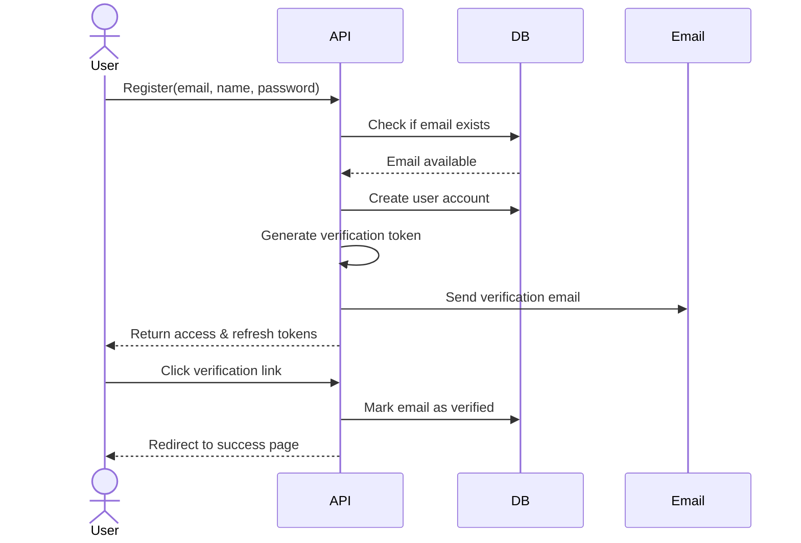
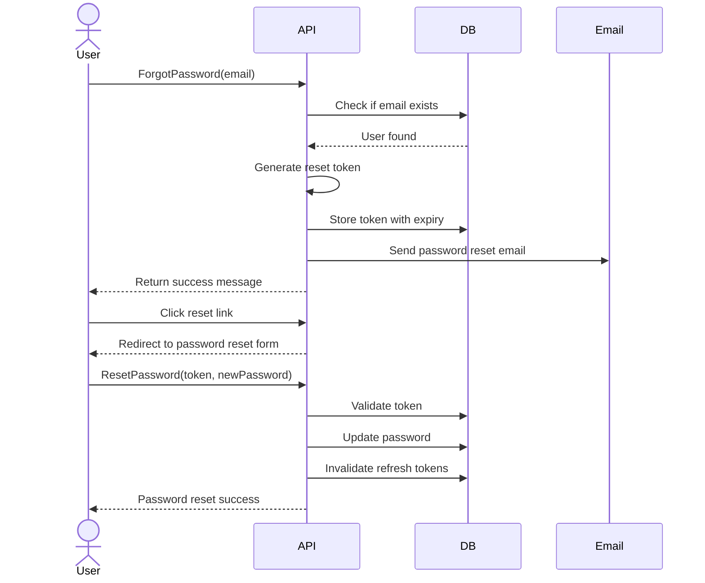

# User Management Guide

This guide explains the user management flows and processes in the BookmarkAI application.

## Authentication Flows

### Registration Process

1. User submits registration form with email, name, and password
2. System validates the form data and checks for existing accounts
3. If valid, the system:
   - Creates a new user account
   - Generates a verification token
   - Sends a verification email
   - Issues access and refresh tokens
4. User receives a verification email with a link to verify their account
5. Upon clicking the verification link, the user's email is marked as verified



### Login Process

1. User submits login form with email and password
2. System validates credentials and checks account status
3. If valid, the system:
   - Records last login timestamp
   - Resets failed attempt counter (if any)
   - Issues access and refresh tokens
4. User is authenticated and can access protected resources

### Password Reset Flow

1. User requests a password reset by providing their email
2. System generates a secure reset token and sends a reset email
3. User clicks the reset link and submits a new password
4. System validates the token and updates the password
5. All refresh tokens for the user are invalidated
6. User can log in with the new password



### Token Refresh Flow

1. When the access token expires, client uses refresh token to get a new pair
2. System validates the refresh token and generates new tokens
3. Old refresh token is invalidated to prevent reuse
4. New token pair is returned to the client

## Account Management

### Email Verification Status

- Newly registered accounts have `emailVerified: false`
- After verification, accounts are marked with `emailVerified: true`
- Users can request a new verification email if needed

### Failed Login Attempts

The system tracks failed login attempts to prevent brute force attacks:

1. Each failed login increments a counter for the user
2. After 3 failed attempts, additional rate limiting is applied
3. Successful login resets the counter to zero

### Password Security

BookmarkAI enforces strong password requirements:
- Minimum length of 8 characters
- At least one uppercase letter
- At least one lowercase letter
- At least one number
- At least one special character

Passwords are hashed using Argon2id with strong parameters:
- Memory cost: 4 MB
- Time cost: 3 iterations
- Parallelism: 1
- Salt length: Automatically generated

### Account Status

Accounts can have the following statuses:
- **Active**: Normal account with full access
- **Unverified**: Email not yet verified but can still access the system
- **Inactive**: Account disabled (admin action)

## User Roles

BookmarkAI supports the following roles:

| Role | Description | Capabilities |
|------|-------------|--------------|
| **user** | Standard user | Access to own content and shared features |
| **admin** | Administrator | Full system access, user management |

## Implementation Details

### JWT Token Structure

**Access Token Claims:**
```json
{
  "sub": "user-uuid",
  "email": "user@example.com",
  "role": "user",
  "jti": "unique-token-id",
  "iss": "bookmarkai",
  "iat": 1715432610,
  "exp": 1715433510
}
```

**Security Measures:**
- Access tokens expire after 15 minutes
- Refresh tokens expire after 7 days
- Tokens are signed using RS256 with AWS KMS
- Tokens are blacklisted on logout or password reset

### Secure Email Handling

- Verification and reset emails contain secure one-time tokens
- Verification tokens expire after 24 hours
- Password reset tokens expire after 1 hour
- Emails are sent via AWS SES in production or Ethereal in development

## Best Practices for Clients

Client applications should:

1. Store the refresh token securely:
   - Mobile apps: Secure storage or Keychain
   - Browser extensions: Encrypted local storage
   - Web app: HTTP-only cookies (automatic)

2. Include the access token with each API request:
   - Set the `Authorization: Bearer <token>` header

3. Implement token refresh when receiving 401 errors:
   - Use the refresh token to obtain new token pair
   - Update stored tokens with new values

4. Handle authentication errors appropriately:
   - 401: Token expired or invalid
   - 403: Insufficient permissions
   - 429: Rate limiting applied